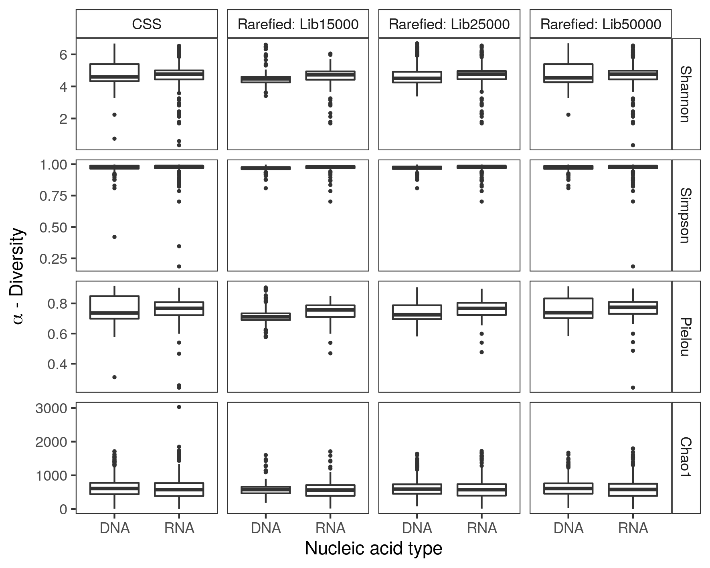
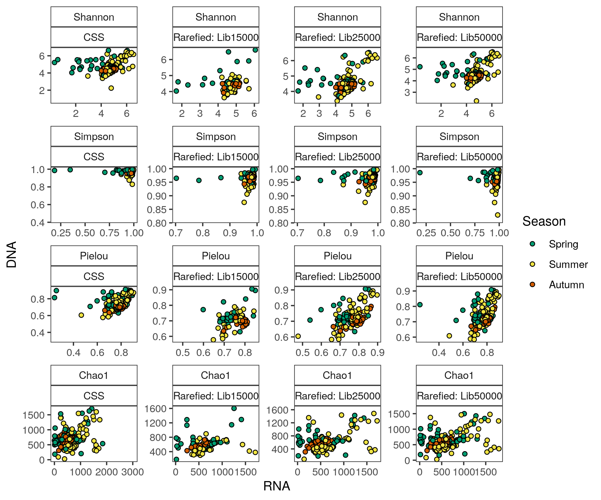
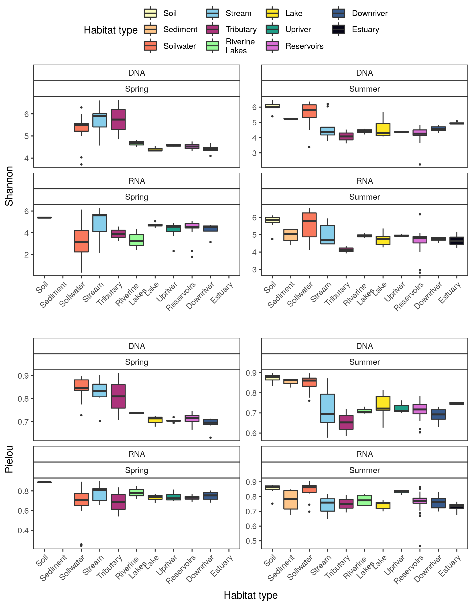

---

The following document contains the supplementary material for the publication "Reactive bacterioplankton reveal assembly dynamics along a boreal terrestrial-aquatic continuum" (DOI: xx). The corresponding R code for the supplementary material can be found on the publication's Github repository: https://github.com/CarBBAS/xxx.

16 Pages, 11 Figures, 1 Table

\newpage

```{r, echo = FALSE, message = FALSE, results = F}
pckgs <- list("data.table", "tidyverse", "kableExtra", "vegan", "ape")
invisible(lapply(pckgs, library, character.only = T))
rm(pckgs)

source("../Functions/custom_fun.R")
```

# Supplementary material and methods

## SM1: Catchment characteristics

The river springs between the Atlantic and Saint Lawrence watersheds (52\textdegree{}52'20"N 63\textdegree{}36'55"W; elevation: 702 masl), and consequently flows through a series of lakes (hereafter riverine lakes) including the biggest lake in the catchment – Lake Brûlé (\textit{A}: 127.11 km\textsuperscript{2}, elevation: 470 masl). The river mainly flows towards the South with a maximum distance from the northern headwaters to the river mouth expanding to approximately 475.1 km. 

The catchment was glaciated 7 000 – 10 000 years ago and left mostly a till blanket and veneer as surficial material. It is mainly dominated by acid rocks (e.g. granodiorite, granite, quart diorite) with granitised sedimentary and volcanic rock, and has isolated patches of permafrost (0-10\%)(Natural Resources Canada). The soil is composed of roughly 61.4\% sand, 31.9\% silt, 6.7\% clay and stores approximately 140.4 t ha\textsuperscript{-1} of organic carbon (in top 5 cm; given are catchment averages) (@Lehner2013, @Hengl2014).

The northern part of the catchment is characterised by a flat open black spruce (\textit{Picea mariana})-lichen forest with shrubs and moss-lichen (Fig. S1a). As one follows the river downstream, the relief changes drastically to a steep mountainous stretch that forms sections of canyons (Fig. S1b). The river looses 330 m of elevation from the mountainous section until it makes a sharp turn to the west into the lower coastal plain. The coastal plain is characterised by peatland areas with swamps and shallow waters that are completely permafrost free (Fig. S1c). There are two larger tributaries in the coastal plain that flow through the lakes Puyjalon (\textit{A}: 13.10 km\textsuperscript{2}) and Allard (\textit{A}: 19.24 km\textsuperscript{2}). Nearly half of the catchment is covered by coniferous forests (\textit{P.mariana}-moss), with mixed forests being rather minor (11\%) and deciduous stands with white birch (\textit{Betula papyrifera}) and trembling aspen (\textit{Populus tremuloides}) are even more rare (2\%)(@HQreport2009).

The Romaine river was dammed during the sampling period, forming a reservoir cascade complex with 4 reservoirs by 2020 after the sampling period. The reservoirs Romaine 2 (RO2, \textit{A}: 81.15 km\textsuperscript{2}, mean depth: 61 m), Romaine 1 (RO1, \textit{A}: 13.22 km\textsuperscript{2}, mean depth: 22 m) and Romaine 3 (RO3, \textit{A}: 35.18 km\textsuperscript{2}, mean depth: 66 m) were flooded in the years 2014 (winter), 2015 (winter), and 2017 (spring), respectively.

A weather station located in the lower coastal plain (50\textdegree{} 16'55.000" N, 63\textdegree{} 36'41.000" W, Havre-Saint-Pierre Airport, Natural Resources Canada) recorded an annual precipitation of 810.77 $\pm$ 35.25 mm and 1.18 $\pm$ 0.73 \textdegree{}C, -32.63 $\pm$ 1.36 \textdegree{}C, and 25.8 $\pm$ 0.66 \textdegree{}C for mean, minimum and maximum temperature over the sampled years.

## SM2: Sample processing and sequencing

Surface water samples were directly collected into a pre-rinsed carboy bottle at a depth of 0.5 m, close to the shore for stream samples and diverse locations within the river and reservoirs. Surface soil samples were collected by mixing three randomly selected cores (30 cm) that were taken in proximity of installed piezometers to sample soilwater. The upper 5 cm including surface vegetation were removed before the soil was transferred into a sterile plastic bag. Three piezometers were randomly installed in proximity (30-100 cm) to a sampled stream with an average depth of 50 $\pm$ 20 cm. However, if the piezometers were installed too close to the stream main channel, hyporheic water was sampled instead. Piezometers were emptied 3 times (1-2 h) with a peristaltic pump before sample water was collected. The water from the piezometers was pooled for each site. Groundwater was directly collected from constructed wells with submersible pumps. Lake sediment samples were collected with sediment cores (1-2 m depth), and the upper 10 cm were collected and mixed for subsequent processing. All samples were stored at 4 \textdegree{}C upon arrival at the laboratory until further processing on the same day of sampling. A minimum of 25 mL and 250 mL of soil-/hyporheic-water and surface water, respectively, were filtered through 0.22 µm polycarbonate membrane filters (Merck Millipore, Darmstadt, Germany). Homogenized soil and sediment samples were transferred to aliquots of 0.25 g. After filtration, samples for RNA extraction were submerged in RNAlater\textsuperscript{\textregistered} and LifeGuard\textsuperscript{\textregistered} Soil Preservation solution (QIAGEN\textsuperscript{\textregistered}, Hilden, Germany) for water and humic samples (soil, soilwater, hyporheic water), respectively. To allow stabilisation in the buffer, samples were left at 4 \textdegree{}C overnight and were subsequently stored frozen. All DNA and RNA samples were frozen at -20 \textdegree{}C at the field station and further stored at -80 \textdegree{}C at the university laboratory until extraction.

For extractions, PowerWater\textsuperscript{\textregistered} and PowerSoil\textsuperscript{\textregistered} DNA and RNA extraction kits (MoBio, Carlsbad, CA, USA) were used to extract water and soil/soil-/hyporheic-water/sediment samples, respectively. In 2017, the equivalent DNeasy\textsuperscript{\textregistered} and RNeasy\textsuperscript{\textregistered} PowerWater\textsuperscript{\textregistered} Kits (QIAGEN\textsuperscript{\textregistered}, Hilden, Germany) were used for DNA and RNA samples, respectively, due to discontinuation of the MoBio kit series.

Prior to cDNA reverse transcription, RNA extracts were checked for DNA contamination with a negative PCR test. Subsequently, cDNA was synthesised with a high capacity cDNA Reverse Transcription Kit (Applied Biosystems\textsuperscript{\texttrademark}, Foster City, CA, USA). Successful DNA extraction and cDNA synthesis was evaluated via PCR amplification of the 515F-806R primers (IDT Technologies, Coralville, IA, USA) and DNA concentration was measured with a NanoDrop 2000c (Thermo Fisher Scientific Inc., Waltham, MA, USA).

## SM3: Bioinformatic analysis
Primers were removed from 16S rRNA DNA and cDNA (hereafter RNA) data sets using the software \textit{cutadapt} (Version 1.18, @Martin2013), which allows for the removal of the primer sequence and its variants in their true and complement orientations. Additionally, all reads shorter than 125 nucleotides were removed as they cannot achieve a minimum overlap necessary for paired-end merging in downstream processing.

To identify amplicon sequence variants (ASVs), 16S rRNA amplicon reads were analysed through the DADA2 (Divisive Amplicon Denoising Algorithm 2) pipeline (Version 1.14.1, @Callahan2017) on R Version 3.6.3 @RCoreTeam2017). Read qualities were evaluated for each sequencing plate separately and read length was trimmed according to their quality scores. The most conservative trimming criteria still allowed for an overlap of forward and reverse reads by 60 bp. Samples were pooled by plate, season and sequencing depth for learning the error rates. DADA2 runs on a sample by sample basis, and thus removes observed singletons by sample to avoid inclusion of false-positive sequencing errors. To retain more rare taxa within a sampling campaign (year-season combinations) along the continuum, samples were 'pseudo'-pooled for the \textit{dada()} step.  This step enables the removal of singletons by pool but retains singletons within a sample. Paired-ends were merged after successful inference of amplicon variants. Subsequently, all ASVs that are identical in sequence but differ only by length were merged together with \textit{collapseNoMismatch()}, leading to ASVs that represent a unit similar to 100\% similarity operational taxonomic units (OTUs) and chimeras were removed (\textit{removeBimeraDenovo()}). Finally, taxonomy was assigned with the \textit{DECIPHER} package (Version 2.14.0, @Wright2016) implementing the increased accuracy IDTAXA algorithm @Murali2018 and the provided trained classifier of the SILVA database (Version 138, @Pruesse2007). Only ASVs that were classified as Bacteria and not as Mitochondria or Chloroplast were evaluated in this study. Even after merging ASVs into 100\% OTUs, several ASVs were found to be highly abundant only in RNA. To account for slight differences that may have emerged between DNA and RNA ASVs and also to merge potential differences among 16S rRNA copies within a single genome, ASVs were merged into OTUs by a 99\% similarity threshold @Vetrovsky2013 with the \textit{DECIPHER} package (\textit{AlignSeqs(), DistanceMatrix(), IdClusters()}, @Wright2016). To keep computational power low due to the size of the data set, OTU clustering was conducted within taxonomical pools. Such that ASVs classified only as "Bacteria" without any classification in further ranks were pooled for clustering, while any ASV with a classification in any higher rank was clustered with other ASVs that had the same highest assigned taxonomical rank (e.g. "Bacteria-Proteobacteria-Gammaproteobacteria-Burkholderiales-Burkholderiaceae-Limnobacter" pool).

CSS results were compared with results achieved with various rarefaction thresholds. To account for random sampling effects, rarefaction was conducted with 100 random iterations. Similarly to the CSS data treatments, the mean of all iterations was rounded to its integer to be used for subsequent analysis. There were no substantial differences in the results between CSS and various rarefaction thresholds on $\alpha$ diversity estimates, which is believed to be most susceptible to library size differences (Fig. S2). Consequently, CSS results were used for downstream analyses.

## SM4: Data exploration and statistical analyses
To explore differences in microbial community composition across habitat types and seasons, a Principal Coordinates Analysis (PCoA) was conducted with Bray-Curtis dissimilarities ($D_{BC}$) (@Bray1957, @Legendre1998) based on all DNA samples with the function \textit{pcoa} in the \textit{ape} package (@Paradis2018) (n = 372, 20182 OTUs). The community matrix was Hellinger transformed to resolve a horse-shoe effect (@Legendre2001). To correct any negative eigenvalues problematic for PERMANOVA analysis, the $D_{BC}$ matrix was square-root transformed to Euclidean distance (@Legendre1998, @Borcard2011). To evaluate statistical differences in habitat type and season a PERMANOVA was computed with 9999 permutations with the \textit{adonis} function. A PERMANOVA cannot distinguish among-group from within-group variation if data dispersion is variable among groups (@Anderson2013), therefore, an analysis of multivariate homogeneity was computed with \textit{betadisper}. Using \textit{permutest}, we finally tested whether dispersion differs between groups.

Secondly, to evaluate whether sampled RNA-based assemblages were different from the DNA-based assemblages, we performed a second PCoA ($D_{BC}$ with square-root transformation) with both DNA and RNA samples (n = 572, 20185 OTUs). Again, statistically different groups were investigated with a PERMANOVA (9999 permutations), where habitat type, season and nucleic acid type (DNA vs. RNA) formed the groups. The same framework explained above to check for dispersions was applied. To quantify how different DNA-/RNA-based assemblages of the same sample are, the Bray-Curtis distance (m\textsubscript{BC}) of each DNA-RNA sample pair within the PCoA ordination space was computed across \textit{n}-dimensional space (@Tabak2004):


\[ m(p,q) = \sqrt{(\mid p_{1} - q_{1} \mid)^2 + (\mid p_{2} - q_{2} \mid)^2 + \cdots + (\mid p_{n} - q_{n} \mid)^2}\]


where $p$ and $q$ represent DNA and RNA site scores, respectively, of each sample and $n$ is the used maximum number of dimensions. We focused on the first axes that cumulatively explain 75\% of the variation for each ordination (n\textsubscript{75\%}), similar to (@Osterholz2016). This approach was implemented as it was evident from the PCoA that essential variation within non-aquatic samples was captured outside the first three axes. The distance across all PCoA axes equals the initial pair-wise dissimilarity on which the PCoA is based on (Fig. S3). As such, the distance across n\textsubscript{75\%} axes extracts the proportion of the initial pair-wise dissimilarity that is captured by the axes cumulatively explaining 75\% of the PCoA.

To gain further insight into the processes shaping assemblage dissimilarities, we computed a PCoA with the S{\o}rensen dissimilarity ($D_{S}$), which is the incidence based equivalent of $D_{BC}$ (square-root transformed to achieve Euclidean space) (@Legendre1998, @Sorensen1948)(Fig. S4). By comparing incidence and abundance based dissimilarities, we can further distinguish in which samples DNA-/RNA-based assemblages diverge primarily due to different present taxa or their abundances, respectively. We further applied the same framework of calculating the distance among DNA and RNA pairs across n\textsubscript{75\%} (236 of 571) axes resulting the S{\o}rensen-based distance (m\textsubscript{S}). 

## SM5: Abundance classification
Traditionally, abundance groups (AGs) such as "abundant" and "rare" have been defined by various relative abundance thresholds ranging from 0.1 to 1 \% within the literature. While inconsistencies hinder comparisons among studies, we additionally are working with variance stabilised read numbers, thus traditional thresholds based on relative abundances are not applicable. In order to classify OTUs into AGs, we developed a new framework to classify OTUs into AGs based on the shape of rank abundance curves of each habitat. We initiate the framework by calculating the mean abundance of each OTU by habitat type. Subsequently, for each habitat type a smoothed rank abundance curve was generated with the function \textit{smooth.spline} with the smoothing parameter set to 0.7 in base R (Fig. S5a). Ranks that correspond to moments of acceleration along the curve were identified by taking the second derivative of the log(x + 1) transformed abundance curve (Fig. S5c). All OTUs ranked below the second maximum acceleration were defined as rare. OTUs falling above the first maximum acceleration were defined as abundant, while the section in between the two maxima represents moderately abundant OTUs (Fig. S5a). The CSS reads corresponding to the ranks identified for the AGs were extracted for each habitat type separately. Subsequently, the average CSS reads for each abundance threshold was calculated. This approach classified all OTUs with >= 47 CSS reads as abundant, < 47 and >= 5 CSS reads as moderate, and < 5 CSS reads as rare.

## SM6: Software details
The packages \textit{phyloseq}, \textit{tidyverse}, \textit{plyr} and \textit{data.table} were used for data wrangling and transformation (@McMurdie2013,@Wickham2019, @Wickham2011, @Dowle2019), and \textit{doMC} and \textit{parallel} enabled parallel processing (@Analytics2019, @RCoreTeam2017). \textit{ggplot2}, \textit{ggpubr}, \textit{ggnewscale} and \textit{cowplot} were used to visualize the results (@Wickham2016, @Kassambara2018, @Campitelli2020, @Wilke2019). For statistical analyses, \textit{vegan} and \textit{rstatix} were used (@Oksanen2017, @Kassambara2020). 

Maps were created with QGIS (version 3.12) and a digital elevation model provided by Natural Resources Canada. Watersheds were delineated with ArcMap (version 10.5.1, ESRI Inc., Redland, CA) and the Spatial Analyst Toolbox.

---

# Supplementary figures

### Figure S1: Landscape within the Romaine catchment
```{r, echo=FALSE, fig.show='hold',fig.align='center', out.width = "70%"}
knitr::include_graphics("./Figures/LR_photo_collage.png")
``` 

(a) Northern area with shrubs and moss-lichen, (b) Mountainous section close to Reservoir 3, (c) Lower coastal plain with peatland areas, (d) Example of a sampled stream.

### Figure S2: No substantial effect of data transformation methods on $\alpha$-diversity estimations

{ width=55% } { width=58% }

Comparing the effect of rarefaction on $\alpha$ diversity patterns. Four different $\alpha$ diversity indices were investigated: Shannon-Wiener index (H'), Simpson's index ($\lambda$), Pielou's evenness (J) and Chao1 richness estimator. CSS = cumulative sum scaling. Rarefied datasets with the applied minimum library size threshold are indicated as "Lib[threshold]". 

### Figure S3: Distance along all PCoA axes equal pair-wise dissimilarity

```{r, echo=FALSE,fig.show='hold',fig.align='center', out.width = "70%"}
knitr::include_graphics(c("../Figures/Final/allaxesdist_dissim_cor.png"))
``` 
As a proof of concept, the computed distance (e.g. m\textsubscript{BC}) extracts a proportion of the individual pair-wise dissimilarities, summation of the distances across all PCoA dimensions (n = 100%) equals the initial pair-wise Bray-Curtis dissimilarities, which is the input matrix into the PCoA. Thus, computing the pair-wise distance among a sub-selection of axes of the PCoA captures a proportion of the overall pair-wise dissimilarity that is explained by the variation and drivers of the selected axes.

### Figure S4: Schematic representation of n-distance calculation
```{r, echo=FALSE,fig.show='hold',fig.align='center', out.width = "90%"}
knitr::include_graphics(c("Figures/N-distance concept.png"))
``` 

### Figure S5: Statistical support for residual interpretations
```{r, echo=FALSE,fig.show='hold',fig.align='center', out.width = "90%"}
knitr::include_graphics(c("../Figures/Final/resid_krusk_tests.png"))
``` 

Samples were grouped into two distinct categories of residuals > 0 and < 0, respectively. No samples had residuals = 0. Extreme outliers (values above the third quartile plus 3 times the inter-quartile range (IQR) or below the first quartile minus 3 times the IQR) were removed prior to the testing of ANOVA assumptions. For all three variables, normality assumptions were not fulfilled and thus a non-parametric Kruskal-Wallis test was conducted. Depicted are boxplots where the middle line represents the median, lower and upper hinges correspond to the 25th and 75th percentiles. Upper and lower whiskers expand to the largest and smallest value, respectively, but no further than 1.5 times the IQR from the hinge. **** and ** indicate *p*-values < 0.0001 and < 0.01, respectively (based on Kruskal-Wallis tests).

### Figure S6: Classification of abundance groups
```{r, echo=FALSE,fig.show='hold',fig.align='center', out.width = "90%"}
knitr::include_graphics(c("../Figures/Final/abundance_class_ex_otu99.png"))
``` 

Classification of abundance groups based on derivative approximation of the log transformed rank abundance curve by habitat type, where a) represents the original rank abundance curve and b) the log transformed equivalent to derive points of maximum and minimum acceleration. The blue point represents the first minimum of the second derivative, red points are the first and second maxima of the second derivative. Pink, green and blue ranges visualise abundant, medium and rare classifications, respectively.

### Figure S7: Taxonomic composition of habitat types

```{r, echo=FALSE,fig.show='hold',fig.align='center', out.width = "100%"}
knitr::include_graphics(c("../Figures/Final/Tax_LibSiz_Phyla_otus.png"))
``` 

Given are averages of phyla found across habitat types. Upper panel shows average library sizes across habitat types. Error bars indicate the standard deviation from the mean.

### Figure S8: $\alpha$-diversity decreases along the continuum
```{r, echo=FALSE,fig.show='hold',fig.align='center', out.width = "80%"}

```

Autumn data not shown due to low coverage of habitat types. Depicted are boxplots where the middle line represents the median, lower and upper hinges correspond to the 25th and 75th percentiles. Upper and lower whiskers expand to the largest and smallest value, respectively, but no further than 1.5 times the IQR from the hinge.

### Figure S9: No clear clustering within terrestrial samples

```{r, echo=FALSE,fig.show='hold',fig.align='center', out.width = "100%"}
knitr::include_graphics("../Figures/General/terr_PCoA.png")
```

PCoA analysis with square rooted Bray-Curtis dissimilarity on log\textsubscript{2}(x + 1) transformed community matrix with only terrestrial samples (n = 158, 13201 OTUs). Habitat types are distinguished by colour, seasons are indicated by shapes and nucleic acid type are visualised by differences in opacity.

### Figure S10: Habitat type and seasonal separation of RNA

```{r, echo=FALSE,fig.show='hold',fig.align='center', out.width = "100%"}
knitr::include_graphics("../Figures/Final/PCoA_log_RNA_SampleType.png")
```

PCoA analysis with square rooted Bray-Curtis dissimilarity on log\textsubscript{2}(x + 1) transformed community matrix of all RNA samples (n = 200, 10036 OTUs). Habitat types are distinguished by colour and seasons are indicated by shapes.

### Figure S11: Only summer indicates consistent relationship between DNA and RNA $\alpha$-diversity
```{r, echo=FALSE,fig.show='hold',fig.align='center', out.width = "100%"}
knitr::include_graphics("../Figures/Final/alpha.div.dna.rna.lm.png")
```

Linear regressions between $\alpha$ diversity indices of DNA and RNA. Regression lines are only given for significant models. Colours correspond to seasons, regression formulae and statistics are given in the respective seasonal colours.

# Suppplementary Tables

### Table S1: Number of samples per habitat type.
Number of samples are given per habitat type. 
```{r, echo = F}
met.df <-
  select_newest(path = "../Output", file.pattern = "201520162017_meta_otu99_data_")
met.df <-
  read.csv(
    paste0("../Output/", met.df),
    sep = ";",
    dec = ".",
    stringsAsFactors = F
  )

# get number of samples for methods
setDT(met.df)
met.df$sample.type.year <- factor(met.df$sample.type.year, levels = c("Soil","Sediment",
                                                                      "Soilwater","Hyporheicwater", 
                                                                      "Wellwater","Stream", "Tributary",
                                                                      "HeadwaterLakes", "PRLake", "Lake", "IslandLake",
                                                                      "Upriver", "Downriver","RO3", "RO2", "RO1","Deep",
                                                                      "Marine"),
                                  labels = c("Soil","Sediment",
                                             "Soilwater","Soilwater", 
                                             "Groundwater","Stream", "Tributary",
                                             "Riverine Lakes", "Headwater Ponds", "Lake", "Lake",
                                             "Upriver","Downriver",
                                             "Reservoirs","Reservoirs", "Reservoirs","Reservoirs",
                                             "Estuary"))

met.df$Season <- factor(met.df$Season, levels = c("spring","summer","autumn"),
                        labels = c("Spring","Summer","Autumn"))

met.df$DnaType <- factor(met.df$DnaType, levels = c("DNA","cDNA"),
                         labels = c("DNA","RNA"))

n.table <- met.df[, .(n = .N), by = .(sample.type.year, DnaType)][order(sample.type.year, DnaType)]
n.table <- dcast(n.table, DnaType ~ sample.type.year, value.var = "n", fill = 0)
colnames(n.table)[1] <- "Nucleic Acid Type"
n.table[, Sum := sum(.SD, na.rm = T), .SDcols = c("Soil","Sediment",
                                             "Soilwater", 
                                             "Groundwater","Stream", "Tributary",
                                             "Riverine Lakes", "Headwater Ponds", "Lake",
                                             "Upriver","Downriver",
                                             "Reservoirs",
                                             "Estuary"), by = 1:nrow(n.table)]

knitr::kable(n.table, "latex", booktabs = T) %>%
  column_spec(1:ncol(n.table), width = "0.5cm") %>%
  row_spec(0, angle = 45)
```

---

# References